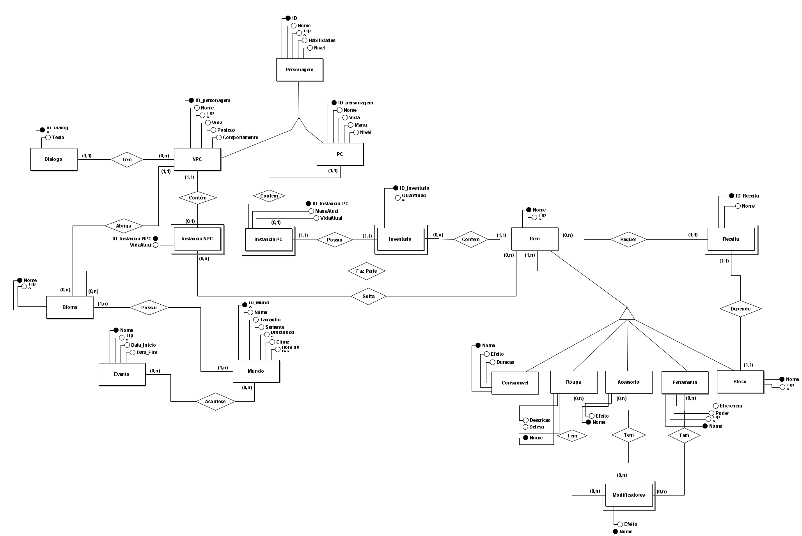
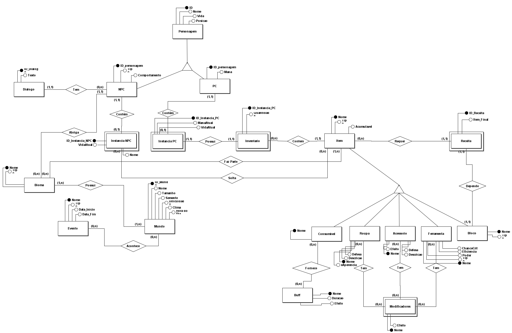
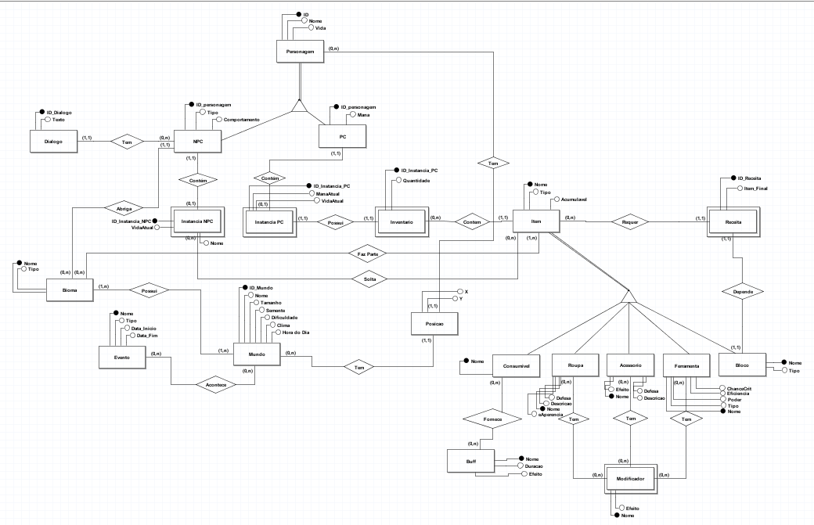

# Modelo Entidade Relacionamento(MER)
O modelo Entidade Relacionamento é um modelo conceitual que repersenta de forma abstrata a estrutura 
que o banco de dados da aplicação terá, contendo entidades, atributos e relacionamentos.

## Versão 1

## Versão 2

## Versão 3 

## Versão 4

# Histórico de Versão

| Versão | Data       | Descrição                                     | Autor       |
|--------|------------|-----------------------------------------------|-------------|
| 1.0    | 2024-07-20 | Criação do Documento e adição da Versão 1 e 2 do DER        | [Thiago](https://github.com/Thiab394)  |
| 2.0    | 2024-07-21 | Adição da Versão 3 do DER        | [André](https://github.com/AGoretti)
| 3.0    | 2024-07-22 | Adição da Versão 4 do DER        | [André](https://github.com/AGoretti) [Thiago](https://github.com/Thiab394)

