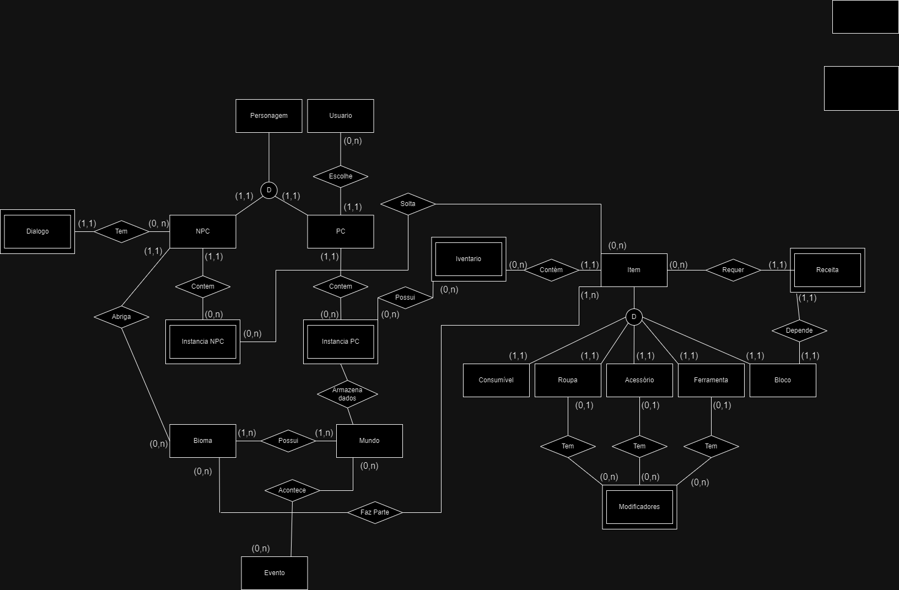

# Modelo Entidade Relacionamento(MER)
O modelo Entidade Relacionamento é um modelo conceitual que repersenta de forma abstrata a estrutura 
que o banco de dados da aplicação terá, contendo entidades, atributos e relacionamentos.

## Versão 1

# Histórico de Versão

| Versão | Data       | Descrição                                     | Autor       |
|--------|------------|-----------------------------------------------|-------------|
| 1.0    | 2024-07-20 | Criação inicial da Versão 1 do DER-MER        | [Thiago](https://github.com/Thiab394)  |