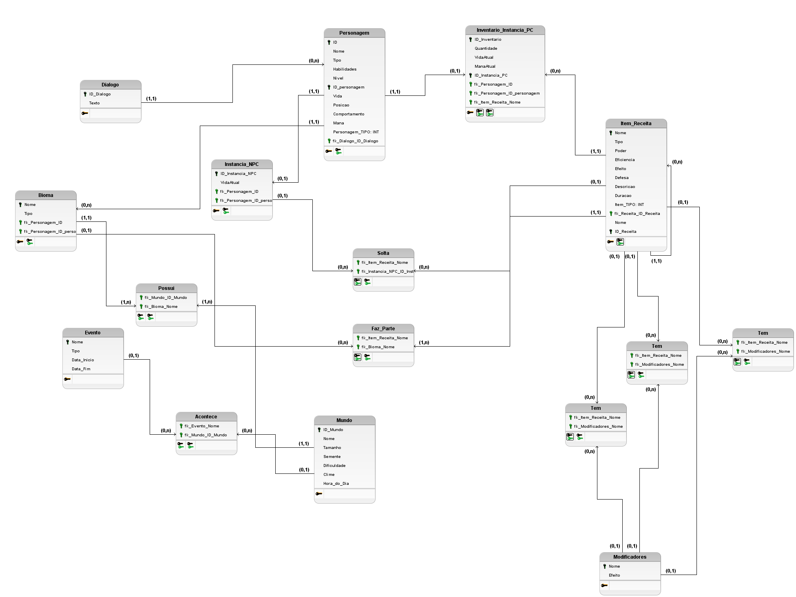
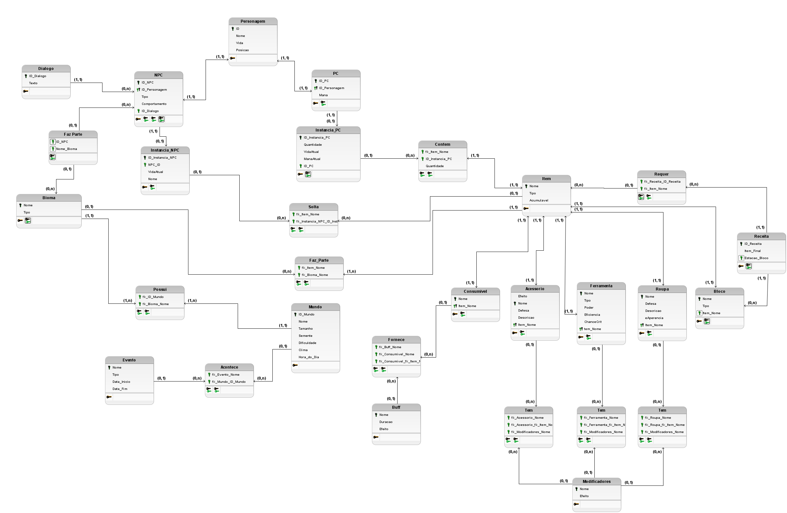
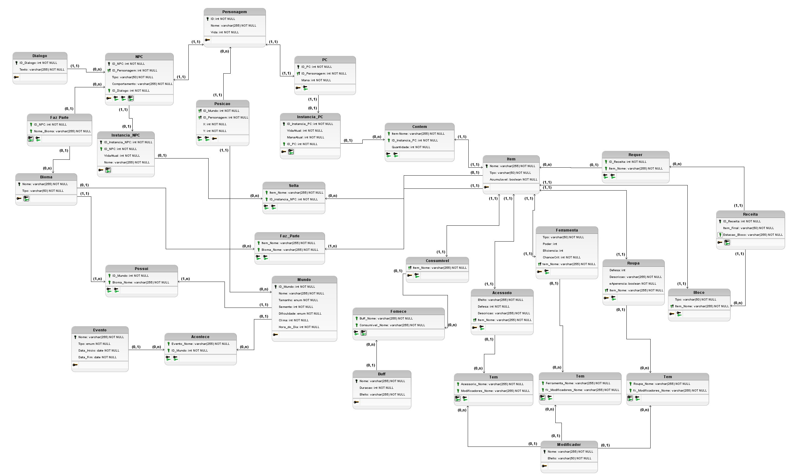

# Modelo Relacional
Um modelo relacional é uma abordagem para gerenciar e organizar dados usando tabelas (ou relações). Cada tabela é composta por linhas (tuplas) e colunas (atributos), onde cada coluna representa um campo de dados específico e cada linha representa um registro único.

## Versão 1

## Versão 2

## Versão 3

# Histórico de Versão

| Versão | Data       | Descrição                                     | Autor       |
|--------|------------|-----------------------------------------------|-------------|
| 1.0    | 2024-07-20 | Criação do Documento e adição do Modelo Relacional V1        | [Thiago](https://github.com/Thiab394)  |
| 2.0    | 2024-07-21 | Adição do Modelo Relacional V2        | [AGoretti](https://github.com/AGoretti)  |
| 3.0    | 2024-07-22 | Adição do Modelo Relacional V3        | [AGoretti](https://github.com/AGoretti) [Thiago](https://github.com/Thiab394) |